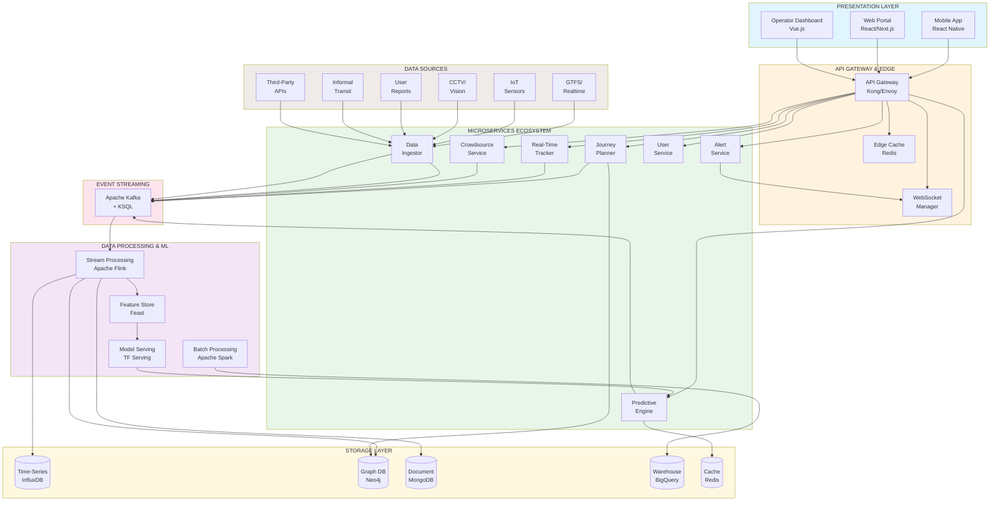
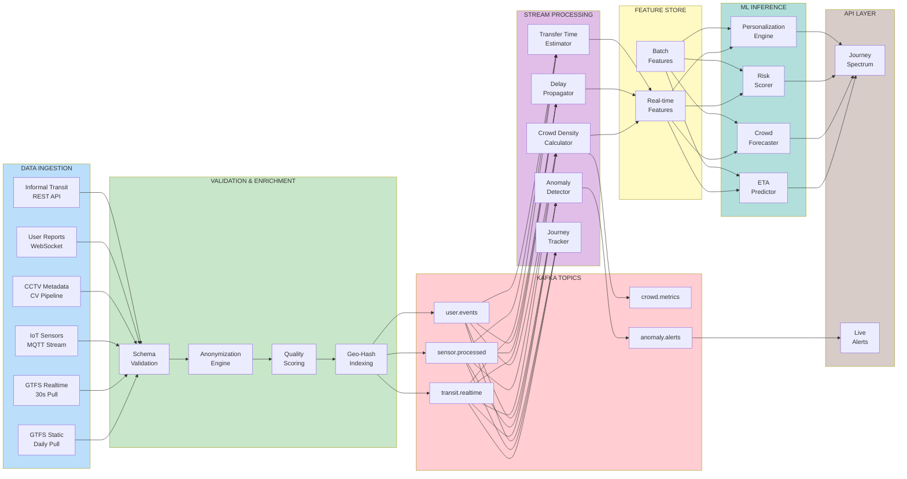
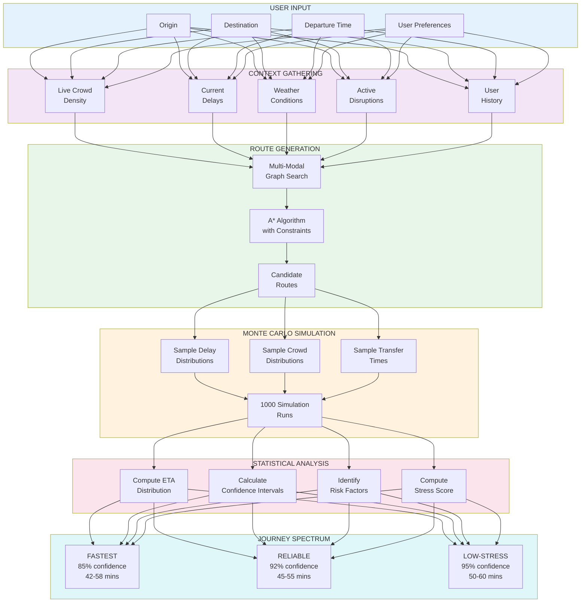
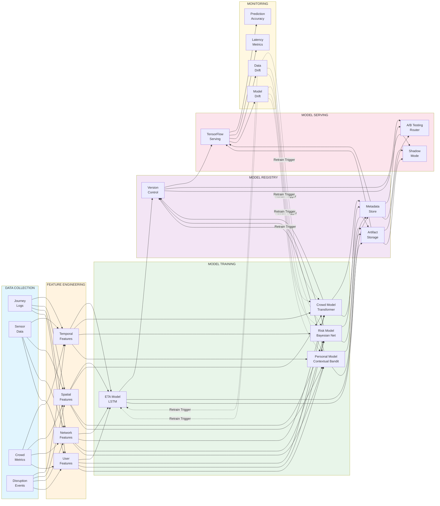
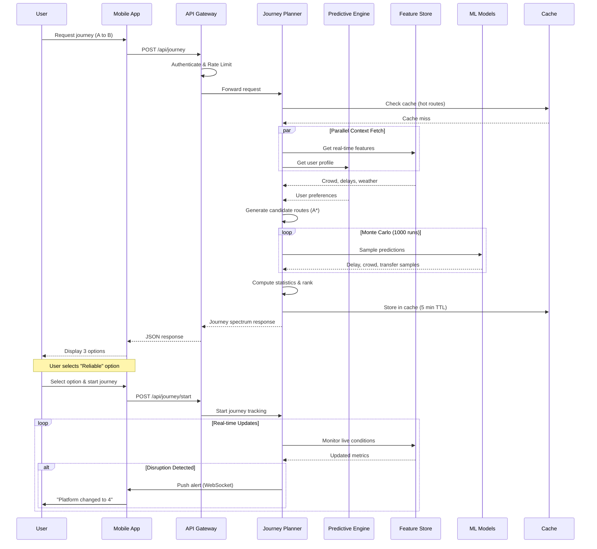
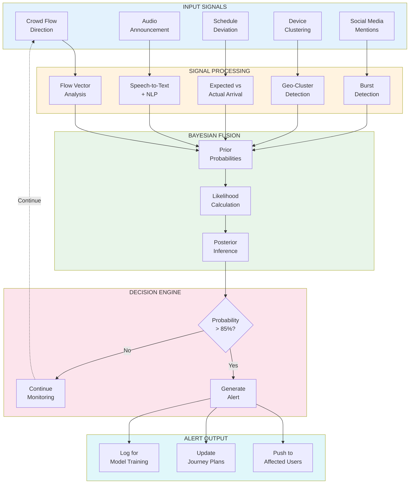
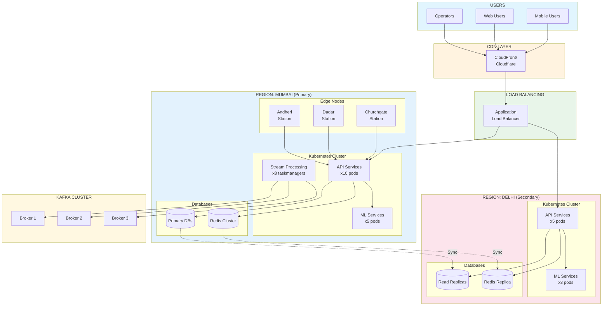
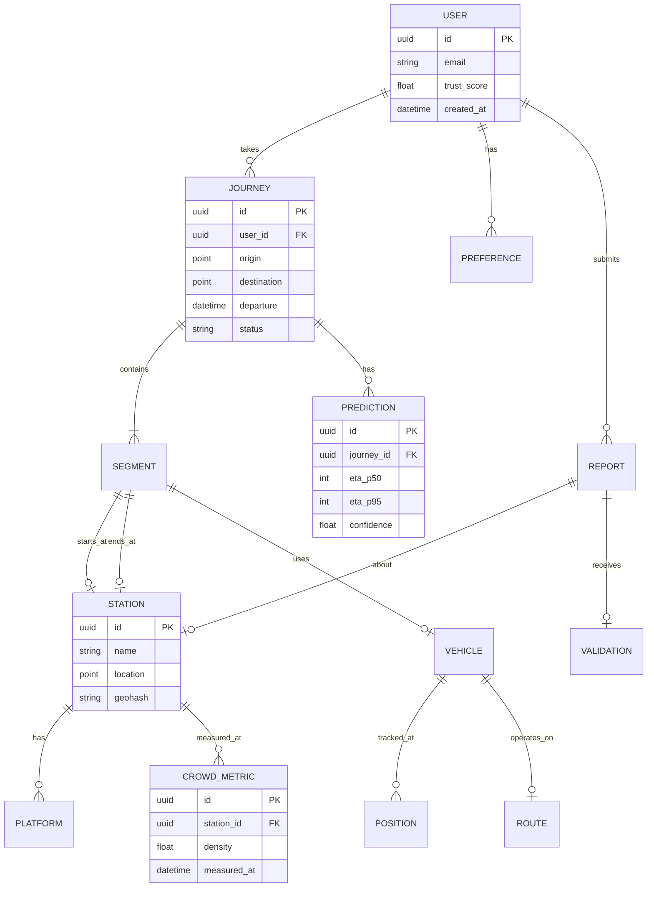

# SynthCommute: Architecture Diagrams

## Visual System Architecture for Hackathon Presentation

---

## 1. High-Level System Architecture

### Mermaid Diagram (renders in GitHub, VSCode, etc.)



---

## 2. Data Flow Architecture



---

## 3. Probabilistic Journey Engine Architecture



---

## 4. ML Pipeline Architecture



---

## 5. User Journey Sequence Diagram



---

## 6. Anomaly Detection Flow



---

## 7. Deployment Architecture



---

## 8. Database Schema Overview



---

## 9. Component Interaction Matrix

```
                    ┌──────┬──────┬──────┬──────┬──────┬──────┬──────┬──────┐
                    │ API  │Journey│Real- │Predict│Crowd │Alert │Feature│ ML  │
                    │Gateway│Planner│Time  │Engine│source│Service│Store │Serve│
┌───────────────────┼──────┼──────┼──────┼──────┼──────┼──────┼──────┼──────┤
│ API Gateway       │  -   │ SYNC │ SYNC │  -   │ SYNC │ WS   │  -   │  -   │
├───────────────────┼──────┼──────┼──────┼──────┼──────┼──────┼──────┼──────┤
│ Journey Planner   │ SYNC │  -   │ SYNC │ SYNC │  -   │ ASYNC│ SYNC │ SYNC │
├───────────────────┼──────┼──────┼──────┼──────┼──────┼──────┼──────┼──────┤
│ Real-Time Tracker │ SYNC │ SYNC │  -   │ SYNC │  -   │ ASYNC│ SYNC │  -   │
├───────────────────┼──────┼──────┼──────┼──────┼──────┼──────┼──────┼──────┤
│ Predictive Engine │  -   │ SYNC │ SYNC │  -   │  -   │  -   │ SYNC │ SYNC │
├───────────────────┼──────┼──────┼──────┼──────┼──────┼──────┼──────┼──────┤
│ Crowdsource Svc   │ SYNC │  -   │  -   │  -   │  -   │ ASYNC│  -   │  -   │
├───────────────────┼──────┼──────┼──────┼──────┼──────┼──────┼──────┼──────┤
│ Alert Service     │ WS   │ ASYNC│ ASYNC│  -   │ ASYNC│  -   │  -   │  -   │
├───────────────────┼──────┼──────┼──────┼──────┼──────┼──────┼──────┼──────┤
│ Feature Store     │  -   │ SYNC │ SYNC │ SYNC │  -   │  -   │  -   │ SYNC │
├───────────────────┼──────┼──────┼──────┼──────┼──────┼──────┼──────┼──────┤
│ ML Serving        │  -   │ SYNC │  -   │ SYNC │  -   │  -   │ SYNC │  -   │
└───────────────────┴──────┴──────┴──────┴──────┴──────┴──────┴──────┴──────┘

Legend: SYNC = Synchronous HTTP/gRPC | ASYNC = Kafka | WS = WebSocket
```

---

## 10. Quick Reference: ASCII Architecture (for terminals)

```
╔═══════════════════════════════════════════════════════════════════════════════╗
║                         SYNTHCOMMUTE ARCHITECTURE                              ║
╠═══════════════════════════════════════════════════════════════════════════════╣
║                                                                                ║
║   ┌─────────────┐    ┌─────────────┐    ┌─────────────┐                       ║
║   │  Mobile App │    │  Web Portal │    │  Operator   │   PRESENTATION        ║
║   └──────┬──────┘    └──────┬──────┘    └──────┬──────┘                       ║
║          │                  │                  │                               ║
║          └──────────────────┼──────────────────┘                               ║
║                             ▼                                                  ║
║   ┌─────────────────────────────────────────────────────┐                     ║
║   │              API GATEWAY (Kong/Envoy)                │   GATEWAY          ║
║   │         Auth | Rate Limit | WebSocket | Cache        │                     ║
║   └──────────────────────────┬──────────────────────────┘                     ║
║                              │                                                 ║
║   ┌──────────────────────────┼──────────────────────────┐                     ║
║   │                          ▼                          │                     ║
║   │  ┌─────────┐ ┌─────────┐ ┌─────────┐ ┌─────────┐   │   MICROSERVICES     ║
║   │  │ Journey │ │Real-Time│ │Predictive│ │Crowdsrc │   │                     ║
║   │  │ Planner │ │ Tracker │ │ Engine  │ │ Service │   │                     ║
║   │  └────┬────┘ └────┬────┘ └────┬────┘ └────┬────┘   │                     ║
║   └───────┼───────────┼───────────┼───────────┼────────┘                     ║
║           │           │           │           │                               ║
║   ┌───────┴───────────┴───────────┴───────────┴────────┐                     ║
║   │              APACHE KAFKA (Event Bus)               │   STREAMING         ║
║   └──────────────────────────┬──────────────────────────┘                     ║
║                              │                                                 ║
║   ┌──────────────────────────┼──────────────────────────┐                     ║
║   │  ┌─────────┐ ┌─────────┐ │ ┌─────────┐ ┌─────────┐  │                     ║
║   │  │  Flink  │ │  Spark  │ │ │ Feature │ │   ML    │  │   DATA/ML          ║
║   │  │ Stream  │ │  Batch  │◄┘ │  Store  │ │ Serving │  │                     ║
║   │  └────┬────┘ └────┬────┘   └────┬────┘ └────┬────┘  │                     ║
║   └───────┼───────────┼─────────────┼───────────┼───────┘                     ║
║           │           │             │           │                              ║
║   ┌───────┴───────────┴─────────────┴───────────┴───────┐                     ║
║   │  ┌─────────┐ ┌─────────┐ ┌─────────┐ ┌─────────┐   │                     ║
║   │  │InfluxDB │ │  Neo4j  │ │ MongoDB │ │BigQuery │   │   STORAGE           ║
║   │  │TimeSeries│ │  Graph  │ │Document │ │Warehouse│   │                     ║
║   │  └─────────┘ └─────────┘ └─────────┘ └─────────┘   │                     ║
║   └─────────────────────────────────────────────────────┘                     ║
║                              ▲                                                 ║
║   ┌──────────────────────────┼──────────────────────────┐                     ║
║   │  ┌─────┐ ┌─────┐ ┌─────┐ │ ┌─────┐ ┌─────┐ ┌─────┐  │                     ║
║   │  │GTFS │ │ IoT │ │CCTV │ │ │User │ │3rd  │ │Infml│  │   DATA SOURCES     ║
║   │  │Feed │ │Sensr│ │Feed │ │ │Rpts │ │Party│ │Trnst│  │                     ║
║   │  └─────┘ └─────┘ └─────┘   └─────┘ └─────┘ └─────┘  │                     ║
║   └─────────────────────────────────────────────────────┘                     ║
║                                                                                ║
╚═══════════════════════════════════════════════════════════════════════════════╝
```

---

## How to Use These Diagrams

### For GitHub/GitLab/VSCode:
The Mermaid diagrams will render automatically. Just view the markdown file.

### For Presentations (PowerPoint/Google Slides):
1. Go to [mermaid.live](https://mermaid.live)
2. Paste the Mermaid code
3. Export as PNG/SVG
4. Import into your slides

### For Draw.io/Excalidraw:
Use the ASCII diagram as a reference and recreate with drag-and-drop tools.

### For Hackathon Demo:
The sequence diagram (#5) is perfect for explaining the user flow during a live demo.

---

*Diagrams Version: 1.0*
*Compatible with: Mermaid 9.x+*
